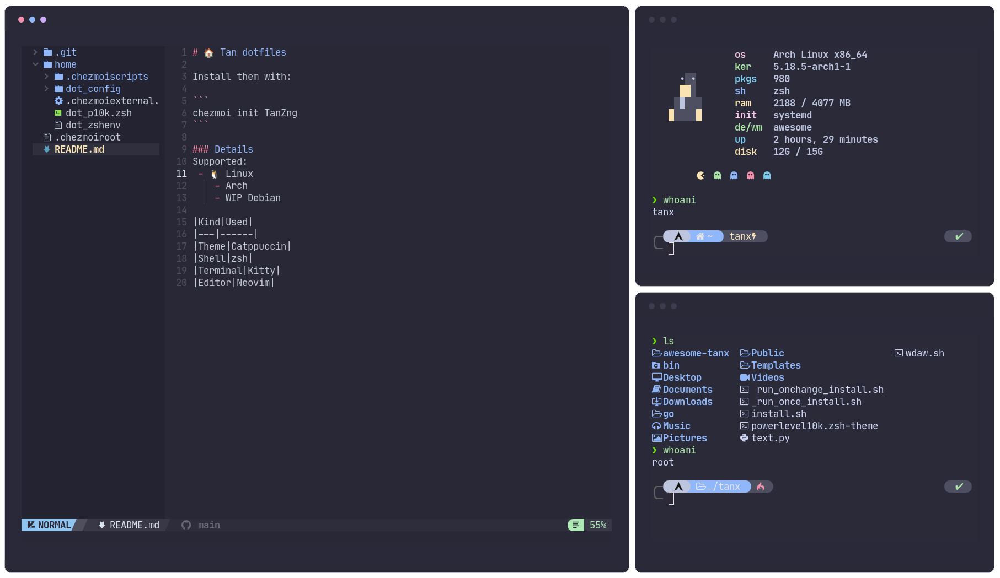

# 🏠 Tan dotfiles

Install them with:

```
chezmoi init TanZng
```



### Details
Supported OS
 - 🐧 Linux (Arch & WIP Debian)

|||
|-------|----|
|Shell|zsh|
|Terminal|[Kitty](https://github.com/kovidgoyal/kitty)|
|Editor|[Neovim](https://github.com/neovim/neovim)|
|Theme|[Catppuccin](https://github.com/catppuccin)|

<!-- WIP |Windows||
|----|----|
|Shell|zsh|
|Terminal|[Windows Terminal](https://github.com/microsoft/terminal)|
|Editor|[VSCode](https://github.com/microsoft/vscode)| -->


### Tools

> Most tools are installed using the package manager (pacman, yay, apt, brew, winget, choco, etc) of the OS.

ZSH

- [zsh-asdf](https://github.com/ohmyzsh/ohmyzsh/blob/master/plugins/sudo/sudo.plugin.zsh) - installed using `.chezmoiexternal`
- [zsh-autosuggestions](https://github.com/zsh-users/zsh-autosuggestions)
- [zsh-syntax-highlighting](https://github.com/zsh-users/zsh-syntax-highlighting)
- [zsh-sudo](https://github.com/ohmyzsh/ohmyzsh/blob/master/plugins/sudo/sudo.plugin.zsh) - installed using `.chezmoiexternal`
- [powerlevel10k](https://github.com/romkatv/powerlevel10k) - installed using [.chezmoiexternal.toml](/home/.chezmoiexternal.toml)

Utils

- [bat](https://github.com/sharkdp/bat)
    - Debian - installed using [run_onchange_install.sh](/home/.chezmoiscripts/run_onchange_install.sh)
- [fzf](https://github.com/junegunn/fzf)
- [lsd](https://github.com/Peltoche/lsd)
    - Debian - installed using [run_onchange_install.sh](/home/.chezmoiscripts/run_onchange_install.sh)
- [ripgrep](https://github.com/BurntSushi/ripgrep)
<!-- - WIP [mdcat](https://codeberg.org/flausch/mdcat/) - only arch -->

Neovim

- [NvChad](https://github.com/NvChad/NvChad) - installed using [.chezmoiexternal.toml](/home/.chezmoiexternal.toml)

Development

- [asdf](https://github.com/asdf-vm/asdf)- installed using [.chezmoiexternal.toml](/home/.chezmoiexternal.toml)

Fonts

- JetbrainsMono Nerd Font
- Fira Code Nerd Font
- Nerd fonts symbols
- Awesome icons 5
- Awesome icons
- Weather icons