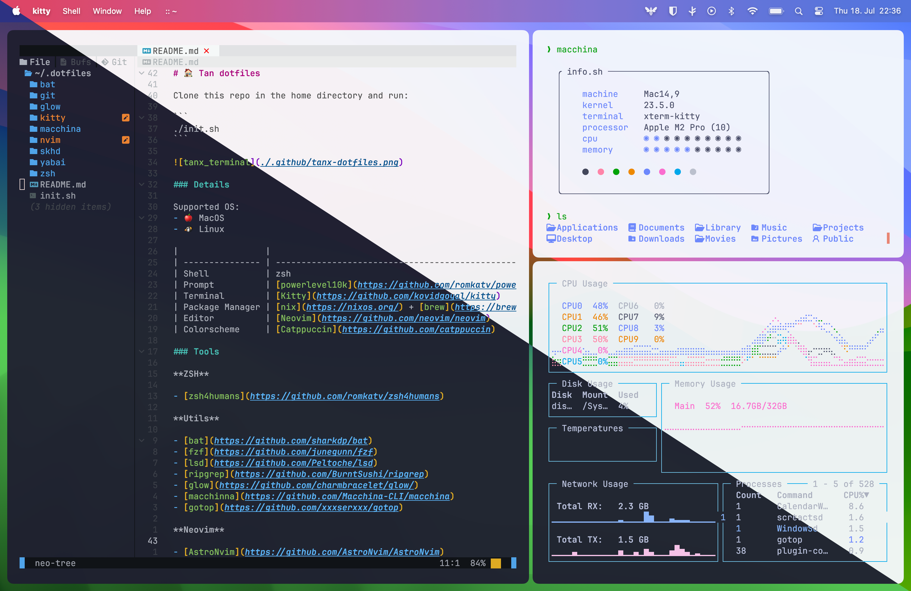

# 🏠 Tan dotfiles

Clone this repo in the home directory and run:

```
./init.sh
```



### Details

Supported OS:
- 🐧 Linux
- 🍎 MacOS 

|||
|-------|----|
|Shell|zsh|
|Shell Prompt|[powerlevel10k](https://github.com/romkatv/powerlevel10k)|
|Terminal|[Kitty](https://github.com/kovidgoyal/kitty)|
|Package Manager|[nix](https://nixos.org/) + [brew](https://brew.sh/)|
|Editor|[Neovim](https://github.com/neovim/neovim)|
|Theme|[Catppuccin](https://github.com/catppuccin)|

### Tools

**ZSH**

- [zsh4humans](https://github.com/romkatv/zsh4humans)

**Utils**

- [bat](https://github.com/sharkdp/bat)
- [fzf](https://github.com/junegunn/fzf)
- [lsd](https://github.com/Peltoche/lsd)
- [ripgrep](https://github.com/BurntSushi/ripgrep)
- [glow](https://github.com/charmbracelet/glow/)

**Neovim**

- [AstroNvim](https://github.com/AstroNvim/AstroNvim) + my-dotfiles

**Development**

- [asdf](https://github.com/asdf-vm/asdf)

**Window Manager**

MacOS:
- [yabai](https://github.com/koekeishiya/yabai) + [skhd](https://github.com/koekeishiya/skhd)

**Fonts**

- JetbrainsMono Nerd Font
- Fira Code Nerd Font

